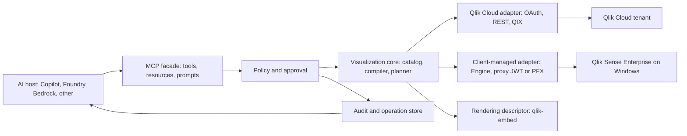

# Reference Architecture

**Status:** Harness decision

**Related:** [Platform matrix](02-platform-support-matrix.md), [MCP contract](08-mcp-server-contract.md)

## Architecture Decision

The harness is a policy-enforced application service with an MCP facade. It receives a constrained intent, discovers target metadata, compiles an approved change plan, calls a Qlik target adapter, and returns bounded results. An AI host never calls Qlik directly and the Qlik adapter never decides policy.



## Responsibilities

| Component         | Must do                                                                                             | Must not do                                         |
| ----------------- | --------------------------------------------------------------------------------------------------- | --------------------------------------------------- |
| MCP facade        | Validate stable tool schemas, expose readiness, and preserve correlation IDs.                       | Store Qlik secrets or compile raw QIX.              |
| Policy/approval   | Authorize, classify risk, issue approval tokens, enforce idempotency.                               | Trust a client-provided approval flag.              |
| Semantic catalog  | Convert authorized Qlik metadata into bounded fields, master items, sheets, and chart capabilities. | Return unbounded app data by default.               |
| Compiler/planner  | Turn validated intent into a versioned native-property proposal.                                    | Guess field names or accept arbitrary QIX requests. |
| Target adapter    | Authenticate to Qlik, execute target APIs, map errors.                                              | Make cross-target policy choices.                   |
| Rendering service | Return a trusted native-object render descriptor.                                                   | Calculate charts outside Qlik.                      |
| Audit store       | Persist sanitized inputs, plan hash, approval, Qlik IDs, and outcome.                               | Store raw tokens or certificates.                   |

## Internal Records

```text
ChartIntent: target, dimensions, measures, filters, presentation, mode
ResolvedChartPlan: resolved refs, native type, property proposal, risk, plan hash
OperationResult: operation ID, status, Qlik object/sheet IDs, preview, audit ID
```

## Mutation Sequence

1. Discover an authorized target and semantic catalog.
2. Resolve a `ChartIntent` deterministically into a change plan.
3. Create a session preview and inspect the evaluated Qlik layout.
4. Create an approval request for a separate authorized reviewer; only an
   approval decision issues a token bound to plan hash, actor, target, and
   expiry.
5. Recheck state and permissions, persist the object, attach it to the sheet,
   and verify it.
6. Store each sanitized lifecycle transition and emit its operation event.

## Technology Direction

**Harness decision:** Use TypeScript/Node.js, Qlik JavaScript tooling, an MCP
TypeScript SDK, schema validation, and durable workflow/audit storage. The
AgentCore edition uses DynamoDB conditional and transactional writes for plans,
approvals, idempotency, latest operation state, and append-only lifecycle
history across microVMs and replicas. It supports separate authenticated
requester/reviewer subjects and prohibits requester self-decision. Validated
file stores remain only as a local single-process option.

## Sources

- [MCP architecture](https://modelcontextprotocol.io/docs/2026-07-28/learn/architecture)
- [Qlik API package](https://qlik.dev/toolkits/qlik-api/)
- [QIX API](https://qlik.dev/apis/json-rpc/)
